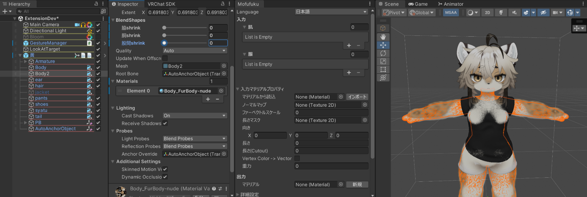
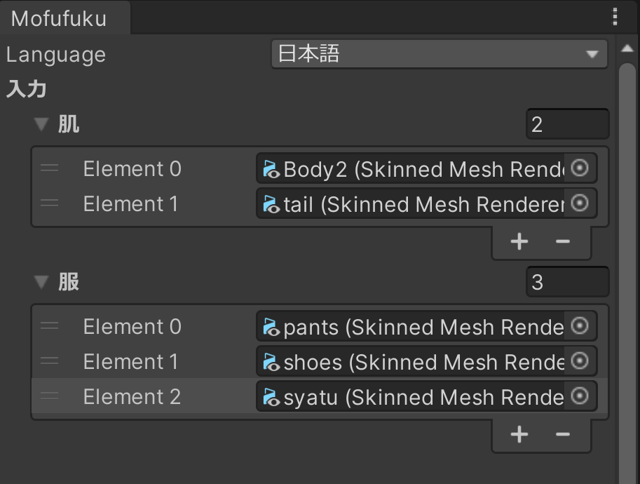
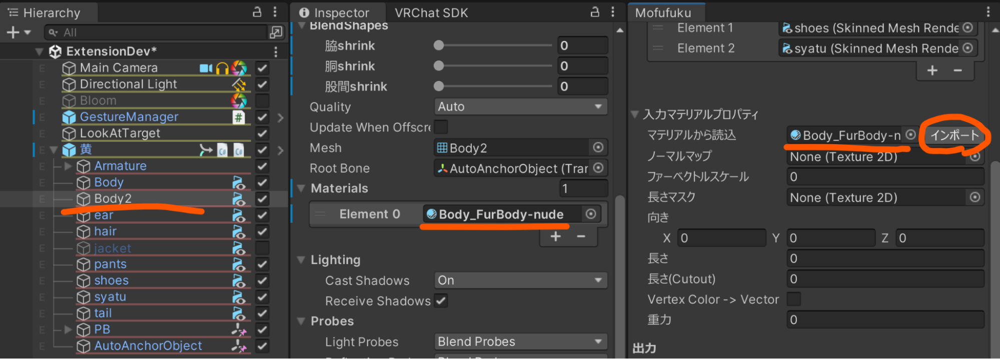
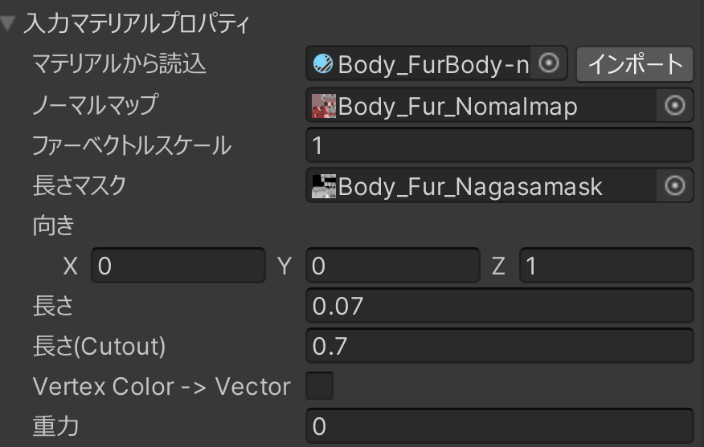
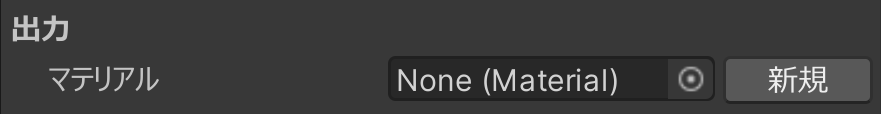
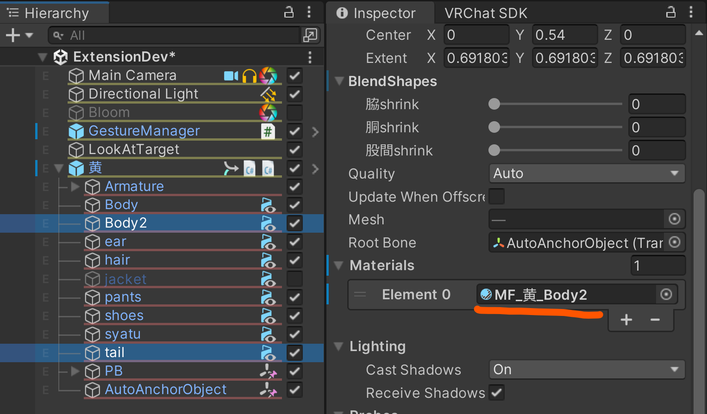
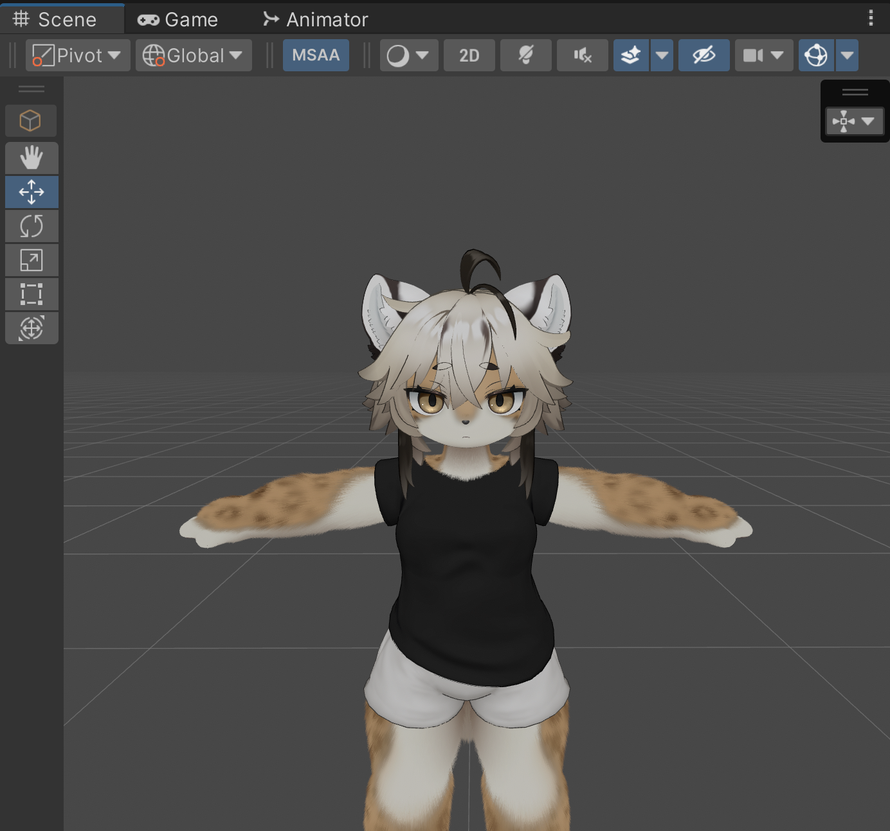

1. Open Mofufuku  
   From the menu, select Window > Someka > Mofufuku to open the editor.  
2. Display the Avatar  
   Add the target avatar to the hierarchy.  
   Dress the avatar, apply the fur material, and adjust blend shapes as needed.  
     
3. Specify Meshes  
   Specify the skin mesh and clothing meshes respectively.  
   [!] The skin mesh must use the same material for all parts/submeshes. If different materials are used, it may not work properly.  
     
4. Specify Material  
   Specify the skin material in Mofufuku's "Input Material Properties" > "Load from Material" and click the "Import" button.  
     
   If the properties appear as shown below, the import succeeded.  
     
5. Generate or Specify Output Material  
   If running for the first time, click Mofufuku's "Output" > "New".  
   If there is a previously generated material, specify it.  
     
   - Generated materials are saved to "Assets/ZZZ_Mofufuku_Generated/". You can move them elsewhere.  
   - The normal map and length mask output by Mofufuku are set to this material.  
6. Apply Material to Avatar  
   Setting the generated material to the skin mesh allows you to immediately check the Mofufuku execution results.  
     
7. Execute  
   Click the "Execute" button. Hair collision should be resolved.  
     
8. Fine-tune  
   Mofufuku has several parameters to control hair collision detection and movement.  
   If Mofufuku can't fully fix the hair, adjust textures (e.g., length masks) manually using an image editor.
