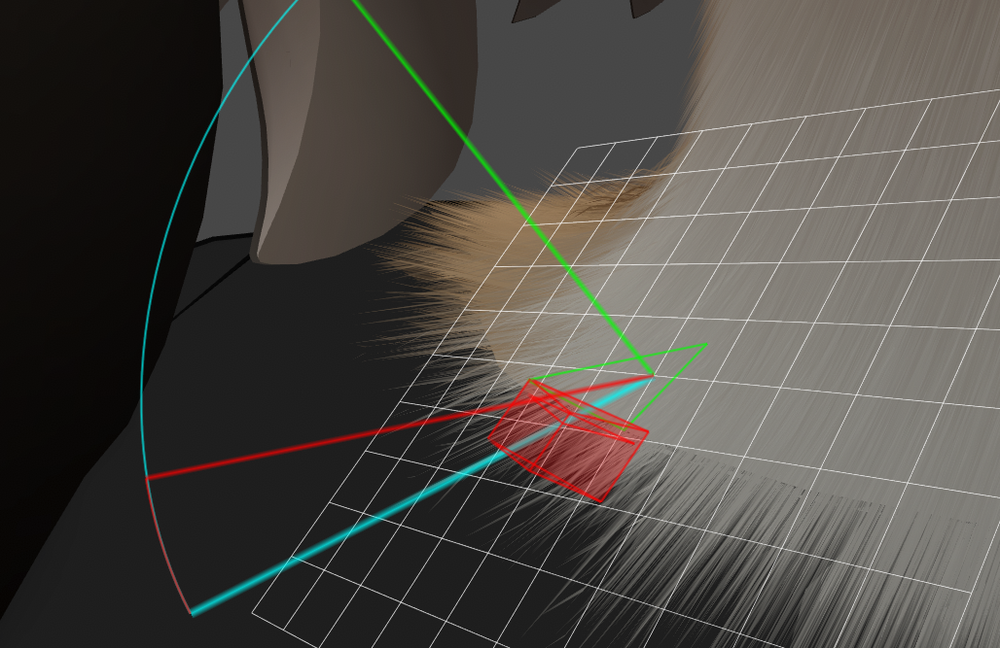
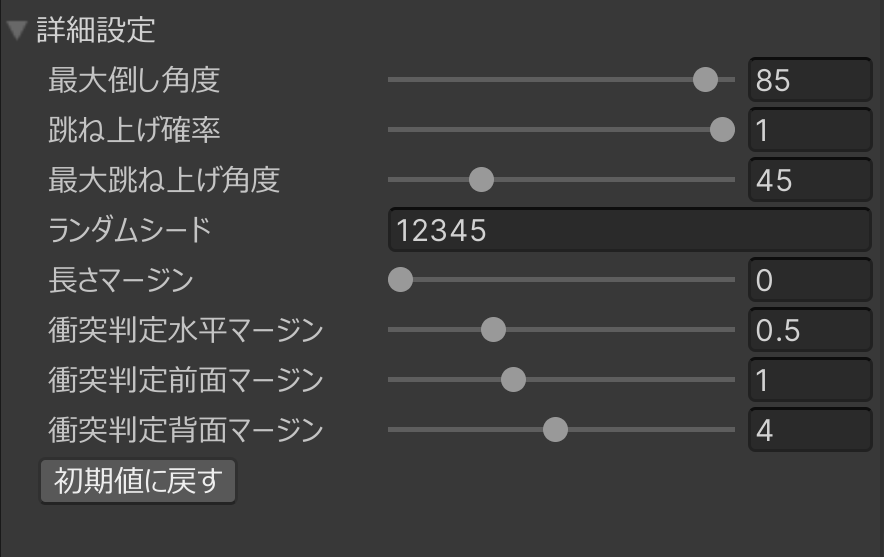
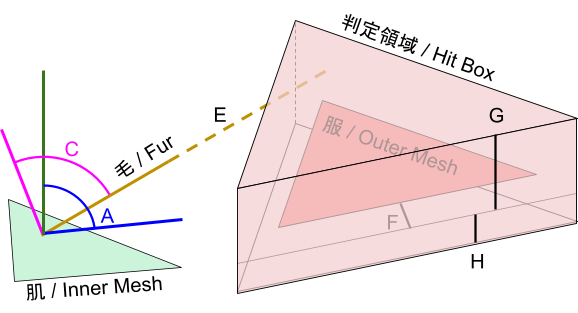

このセクションでは、 Mofufuku 動作の微調整について説明します。t調整無しで実行して貫通が目立つ場合は、下記の説明を参考に調整してください。

### デバッグモード

まず準備として、メッシュの各地点でどのように処理されたかを可視化します。  
“デバッグモード” を ON にして実行してください。  
  
シーン上でメッシュをクリックすると、その地点の処理結果が表示されます。  

- 緑の三角形： 肌のメッシュ  
- 緑の直線： 肌のメッシュに垂直な線  
- 水色の線： オリジナルの毛の向きと長さ  
- 赤い立体： 服のメッシュに衝突判定マージンを合成した領域  
- 赤い直線： 衝突を回避した結果の向きと長さ

### パラメータ

以下のパラメータで Mofufuku の挙動を制御することができます。  

動作：毛とポリゴンの位置関係を計算し、跳ね上げ→倒し→長さ短縮の順で衝突を回避します。  
  （跳ね上げは確率抽選あり）

* とりあえず貫通しないようにしたい場合は、水平マージンを0.5にし、前面マージンと背面マージンを交互に0.5ずつ上げて試すといいです。  
* 毛の起き上がりが激しい場合は、最大跳ね上げ角度を小さくしてください。  
* 倒れてほしいのに短くなってしまう場合は、背面マージンを小さくしてください。  
* 服との境目付近の毛がなくなってしまった場合は、いずれかのマージンが大きすぎるか、倒し角度/跳ね上げ角度が小さすぎます。デバッグモードでその場所をクリックしてヒット状況を確認してください。  
* エディタ上では貫通していないが体を動かしたときに貫通してしまう場合は、長さマージンを大きくしてください。

| 項目 | 説明 |
| :---- | :---- |
| A. 最大倒し角度 | 服に衝突しないように毛を倒す最大角度。 \[値\] 0 \- 90（垂直から倒れる方向の角度） |
| B. 跳ね上げ確率 | 服に衝突しないように毛を起こす確率。 当選しなかった場合と起こしても衝突してしまう場合は、倒す処理が行われます。 \[値\] 0.0(起こさない) \- 1.0(必ず起こす) |
| C. 最大跳ね上げ角度 | 服に衝突しないように毛を起こす最大角度。 \[値\] 0 \- 180（現状の向きから起こす方向の角度） |
| D. ランダムシード | 乱数のシード値。跳ね上げの抽選に使用されます。 \[値\] 0: 毎回異なるシード値。 それ以外: 指定した値でシード固定。 |
| E. 長さマージン | 長さに余裕を持たせて衝突判定します。 ボーンを回転させたときにも衝突を防ぎやすくなります。 \[値\] 0以上(ミリ単位) |
| F. 衝突判定水平マージン | 衝突判定時にポリゴンを拡大してヒットしやすくします。 ポリゴンがとても小さい領域での誤判定を防ぎやすくなります。 \[値\] 0以上(ミリ単位) |
| G. 衝突判定前面マージン | 衝突判定時にポリゴンの表面方向に三角柱を伸ばしてヒットしやすくします。 シャツの襟など、服の端に毛が当たる部分の衝突を防ぎやすくなります。 \[値\] 0以上(ミリ単位) |
| H. 衝突判定背面マージン | 衝突判定時にポリゴンの裏面方向に三角柱を伸ばしてヒットしやすくします。 ズボンの中など、肌と服が平行で密着する部分の衝突を防ぎやすくなります。 \[値\] 0以上(ミリ単位) |

